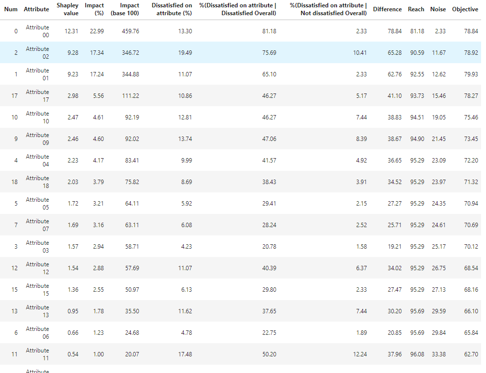

======================================================================================================================
ShapKa: an open source python library to identify customer satisfaction drivers based on Shapley values and Kano model
======================================================================================================================

.. image:: https://img.shields.io/pypi/v/shapka.svg
        :target: https://pypi.python.org/pypi/shapka

.. image:: https://app.codacy.com/project/badge/Grade/2f72d1edadac4962baae68d9c5d901de    
        :target: https://www.codacy.com/gh/uyanik/ShapKa/dashboard?utm_source=github.com&amp;utm_medium=referral&amp;utm_content=uyanik/ShapKa&amp;utm_campaign=Badge_Grade
               
.. image:: https://readthedocs.org/projects/shapka/badge/?version=latest
        :target: https://shapka.readthedocs.io/en/latest/?badge=latest
        :alt: Documentation Status

Installation
------------
Use the following command to install the package:

.. code-block:: python

   pip install ShapKa

Usage
-----
Use the following command for a key dissatisfaction drivers analysis (kda) :

.. code-block:: python 

    import pandas as pd
    from ShapKa.kanomodel import KanoModel
    
    # Load data
    df = pd.read_csv('data/example_03.csv')
    
    # Define X and Y variables names
    y_varname = 'Overall Satisfaction'
    weight_varname = 'Weight'
    X_varnames = df.columns.values.tolist()
    X_varnames.remove(y_varname)
    X_varnames.remove(weight_varname)
    
    # Run analysis to identify key dissatisfiers
    model = KanoModel(df, 
                      y_varname, X_varnames, 
                      analysis = 'kda',
                      y_dissat_upperbound = 6, y_sat_lowerbound = 9,
                      X_dissat_upperbound = 6, X_sat_lowerbound = 9,
                      weight_varname = weight_varname)

    kda = model.key_drivers() ;kda

Here is the ouput :

  
Replace 'kda' by 'kea' in the analysis parameter if you want to identify key enhancers (kea) instead of key dissatisfiers

Documentation
-------------
* Documentation: https://shapleykano.readthedocs.io.

Credits
-------

* The ShapKa package is based on the methodology developped by `W. Michael Conklin, Ken Powaga and Stan Lipovetsky`_

* Some parts of the code are based on functions implemented in the `Open Source Sage Mathematical Software`_

References
----------
* Conklin, Michael & Powaga, Ken & Lipovetsky, Stan. (2004). Customer satisfaction analysis: Identification of key drivers. European Journal of Operational Research. 154. 819-827. 10.1016/S0377-2217(02)00877-9. 

* Sage - Open Source Mathematical Software : `https://github.com/sagemath/sage`_

.. _`W. Michael Conklin, Ken Powaga and Stan Lipovetsky`: https://www.researchgate.net/publication/222399844_Customer_satisfaction_analysis_Identification_of_key_drivers

.. _`https://github.com/sagemath/sage`: https://github.com/sagemath/sage

.. _`Open Source Sage Mathematical Software`: https://github.com/sagemath/sage
